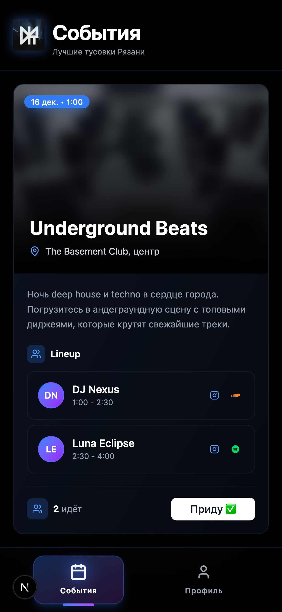
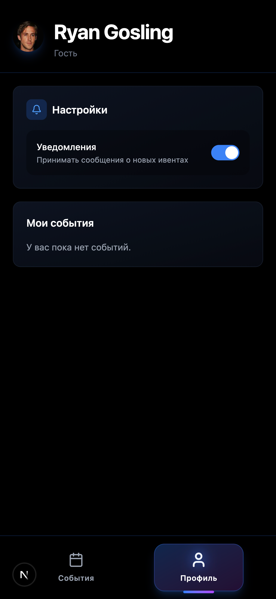

# NITI — Telegram Mini App for Party Events

<div align="center">
  
  
</div>

## 🎉 About

NITI is a Telegram Mini App built with **Next.js 16** and **TypeScript** for discovering and joining party events. The app runs entirely inside Telegram and uses Telegram's authentication system — no separate login required.

### Key Features

- 🎵 **Browse Events** — Discover upcoming parties with DJ lineup details
- 👥 **Join Events** — Subscribe to events with one tap, see participant counts
- 👤 **Profile** — View your subscribed events and manage participation
- 🎨 **Native Telegram UI** — Built with `@telegram-apps/telegram-ui` for seamless experience
- 🔐 **Zero Auth Friction** — Uses Telegram init-data for authentication

### Tech Stack

- **Framework**: Next.js 16 (App Router), React 19, TypeScript
- **UI**: Tailwind CSS 4, `@telegram-apps/telegram-ui`
- **Telegram SDK**: `@telegram-apps/sdk-react`
- **Backend**: Next.js API routes + Supabase (PostgreSQL)
- **Auth**: Telegram init-data validation (via `@tma.js/init-data-node`)
- **Tooling**: Biome (lint/format), pnpm, Sentry

## 🚀 Quick Start

### Prerequisites

- Node.js 18+
- pnpm
- A Telegram Bot (create one via [@BotFather](https://t.me/botfather))
- Supabase project with `SUPABASE_URL` and `SUPABASE_SERVICE_ROLE_KEY`

### Installation

```bash
# Clone and install dependencies
pnpm install
```

### Environment Variables

Create a `.env.local` file:

```env
TELEGRAM_BOT_TOKEN=your_bot_token
SUPABASE_URL=your_supabase_url
SUPABASE_SERVICE_ROLE_KEY=your_service_role_key

# For local development (optional)
NEXT_PUBLIC_ENABLE_MOCKS=true
```

### Development

**Local development with mocks** (no Telegram required):

```bash
pnpm run dev
```

Open [http://localhost:3000](http://localhost:3000). The app will use mock Telegram environment data.

**HTTPS mode** (required for Telegram integration):

```bash
pnpm run dev:https
```

Then (for local development):
1. Visit [https://localhost:3000](https://localhost:3000) and accept the SSL warning
2. Submit `https://127.0.0.1:3000` to [@BotFather](https://t.me/botfather) as your Mini App URL
3. Open [Telegram Web](https://web.telegram.org/k/), find your bot, and launch the Mini App

> **Note:** Using `https://127.0.0.1:3000` as the Mini App URL is only suitable for local development. For production deployment or testing from other devices, configure a publicly accessible HTTPS URL (for example, a proper domain name or a tunnel such as ngrok) in BotFather.

### Available Scripts

```bash
pnpm run dev          # Development server with mocks
pnpm run dev:https    # Development server with HTTPS
pnpm run build        # Production build
pnpm run start        # Start production server
pnpm run lint         # Run Biome linter
pnpm run lint:fix     # Auto-fix lint issues
pnpm run typegen      # Generate Supabase types
```

## 📁 Project Structure

```
src/
├── app/
│   ├── api/                    # Next.js API routes
│   │   ├── events/            # GET /api/events - fetch events
│   │   └── subscriptions/     # POST/GET subscriptions
│   ├── page.tsx               # Main app (EventFeed + ProfilePage)
│   └── layout.tsx             # Root layout
├── components/
│   ├── EventCard.tsx          # Event card component
│   ├── EventFeed.tsx          # Event list feed
│   ├── ProfilePage.tsx        # User profile view
│   └── Root/                  # Telegram SDK wrapper
├── lib/
│   ├── auth-middleware.ts     # checkAuthHeader() for API auth
│   ├── api-client.ts          # authenticatedFetch() helpers
│   ├── supabase.ts            # Supabase admin client
│   └── mocks/                 # Mock data for development
├── core/
│   └── init.ts                # Telegram SDK initialization
└── types/
    └── supabase.ts            # Auto-generated Supabase types
```

## 🔐 Authentication Flow

1. **Client**: Telegram SDK provides `initData` (includes user info)
2. **API Request**: Client sends `x-telegram-init-data` header with raw init data
3. **Backend**: `checkAuthHeader()` validates signature using `TELEGRAM_BOT_TOKEN`
4. **Database**: Service-role Supabase client executes queries (no RLS, auth handled by Telegram)

> **⚠️ Security Warning:** The service-role key bypasses all Postgres Row Level Security (RLS) policies. All authorization logic **must** be implemented in the API middleware layer. Every API route must call `checkAuthHeader()` at the start — a missing check could expose sensitive data or operations. Never commit the service-role key to version control.

Mock mode (`NEXT_PUBLIC_ENABLE_MOCKS=true`) bypasses validation for local development.

> **⚠️ Development Only:** `NEXT_PUBLIC_ENABLE_MOCKS=true` disables authentication and should **only** be used for local development. Never set this variable in production environments — doing so would allow unauthorized access to all API endpoints.

## 🗄️ Database Schema

Key tables (see `supabase/migrations/`):

- **`profiles`** — User profiles (id = Telegram user ID)
- **`events`** — Party events with date, location, lineup
- **`event_lineup`** — DJ sets with time slots
- **`event_participants`** — User subscriptions (unique constraint on event + user)

Run `pnpm typegen` after schema changes to regenerate TypeScript types.

## 🛠️ Development Tips

- **API routes must use `checkAuthHeader()`** at the start of every handler
- **Client-side API calls** should use `authenticatedFetch()` or `authenticatedFetchJson()`
- **Idempotent subscriptions**: Duplicate subscribe requests return 200 (already subscribed)
- **Mock detection**: Backend automatically detects mock data via `hash=some-hash`
- **Test in Telegram**: Always test final builds in Telegram Web/mobile before deploying

## 📦 Deployment

Deploy to [Vercel](https://vercel.com):

```bash
vercel --prod
```

Set environment variables in Vercel dashboard:
- `TELEGRAM_BOT_TOKEN`
- `SUPABASE_URL`
- `SUPABASE_SERVICE_ROLE_KEY`
- `SENTRY_AUTH_TOKEN` (optional)

## 🤝 Contributing

1. Follow Biome style guidelines (`pnpm run lint:fix`)
2. Run `pnpm typegen` after database schema changes
3. Keep API routes idempotent
4. Test in both mock mode and real Telegram environment

## 📄 License

MIT License. See [LICENSE](LICENSE) for details.

## 🔗 Resources

- [Telegram Mini Apps Documentation](https://docs.telegram-mini-apps.com/)
- [@telegram-apps/sdk-react](https://docs.telegram-mini-apps.com/packages/telegram-apps-sdk-react)
- [Supabase Documentation](https://supabase.com/docs)
- [Next.js Documentation](https://nextjs.org/docs)